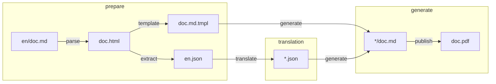

# illuminated

[](https://github.com/getlantern/illuminated/actions/workflows/go.yml)

internationalization tool for GitHub wikis

## purpose

It should be possible for an update to an arbitrary markdown, like en/doc.md, to generate new, complete en.json source files and empty *.json translation files, in addition to generating the doc.md.tmpl which can regenerate the original en/doc.md or any other translation using itself any any *.json translation file. Then generate a pdf for each translation.

## usage
To delete all example files and start over, run:
```sh
```

## process


| step | purpose
| --- | --- |
| parse | English markdown is converted to HTML. |
| extract | Inner HTML strings are extracted to `en.json`. |
| template | Go template is generated from English markdown, corresponding to `en.json`. |
| translate | Translation files are generated. |
| generate | Templates and translation files are combined to generate translated markdown copies. |
| publish | Translated files are combined into single PDF per language. |

## MVP TODO
- [x] read from ~dir~ or ~wiki source~
- [x] write unit tests
- [x] generate TOC
- [x] implement fallback to base language
- [ ] append multiple docs
- [ ] create mechanism for warning on uncurrent translations
- [ ] support pictures
- [ ] test E2E (including Pandoc calls) in CI
- [ ] handle footer