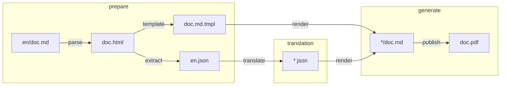

# illuminated
internationalization tool for GitHub wikis

## purpose

It should be possible for an update to an arbitrary markdown, like en/doc.md, to generate new, complete en.json source files and empty *.json translation files, in addition to generating the doc.md.tmpl which can regenerate the original en/doc.md or any other translation using itself any any *.json translation file. Then generate a pdf for each translation.

## process

### parse
English markdown is converted to HTML.

### extract
Inner HTML strings are extracted to `en.json`.

### template
Go template is generated from English markdown, corresponding to `en.json`.

### translate
Translation files are generated.

### render
Templates and translation files are combined to render translated markdown copies.

### publish
Translated files are combined into single PDF per language.

## MVP TODO
- [ ] read from dir or wiki source
- [ ] append multiple docs
- [ ] generate TOC
- [ ] setup CI with pandoc & testing
- [ ] implement fallback to base language 
- [ ] create mechanism for warning on uncurrent translations
