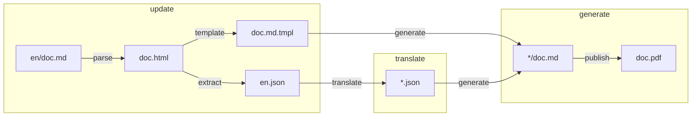

# illuminated

[](https://github.com/getlantern/illuminated/actions/workflows/go.yml)

internationalization tool for GitHub wikis

## purpose

It should be possible for an update to an arbitrary markdown, like en/doc.md, to generate new, complete en.json source files and empty *.json translation files, in addition to generating the doc.md.tmpl which can regenerate the original en/doc.md or any other translation using itself any any *.json translation file. Then generate a pdf for each translation.

## usage

### development
To delete all example files and start over with newly built binary, run:
```sh
$ make local
```

### production

Build binary and initialize with languages and project directory.
```sh
$ go build -o illuminated
$ ./illuminated init --directory docs --base en --target en,zh,fa 
```

Stage the source documentation (either a local filepath or a wiki URL).
```sh
$ ./illuminated update --source $WIKI_URL -d docs
```

After translation, generate html and/or pdf, optionally joined. Strict will fail on any missing translations, otherwise, any missing strings will fallback to the base language specified at initialization.
```sh
$ ./illuminated generate -d docs --html --pdf --join --strict
```
## process


| step | purpose
| --- | --- |
| parse | Markdown in base language is converted to HTML. |
| extract | Inner HTML strings are extracted to `en.json` (or `<baseLang>.json`). |
| template | Go template generated from base language markdown to pair with `.json` content strings. |
| translate | Translation files are generated. |
| generate | Templates and translation files are combined to generate translated markdown copies. |
| pandoc | Pandoc adds (or replaces) a rendered PDF for every language. |

## Future Work
- [x] read from ~dir~ or ~wiki source~
- [x] write unit tests
- [x] generate TOC
- [x] implement fallback to base language
- [x] append multiple docs
- [x] create mechanism for warning on uncurrent translations
- [x] support pictures
- [x] test E2E (including Pandoc calls) in CI
- [ ] support style for pagebreaks
- [ ] handle footer
- [ ] don't mutate data in place
- [ ] default config move to cmd?
